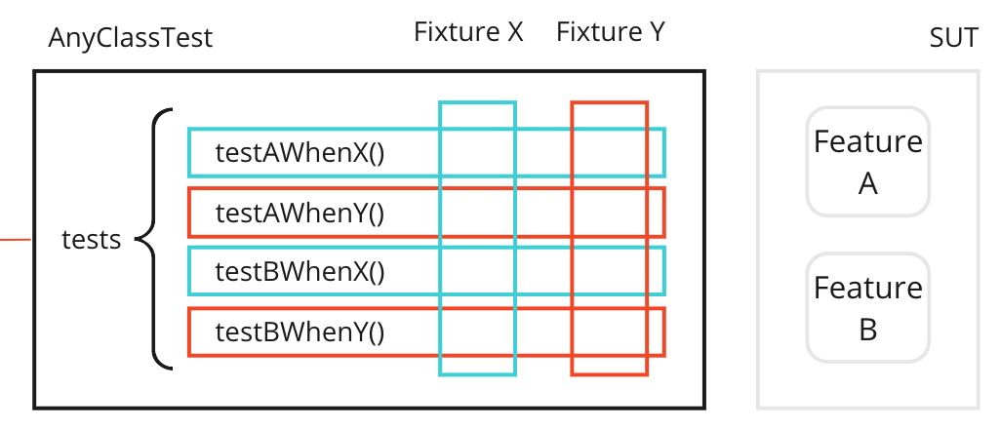

## tltr
Refactor code from testcase by class to testcase by fixture

---

My opinion based on references:

* **xUnit Test Patterns** book by _Gerard Meszaros_
* **Test Drive Development: By Example** by _Kent Beck_.
* **Growing Object-Oriented Software, Guided by Tests** by _Steve Freeman_, _Nat Pryce_
* [Object Mother](https://martinfowler.com/bliki/ObjectMother.html)
* [ObjectMother - Easing Test Object Creation in XP](https://citeseerx.ist.psu.edu/viewdoc/download?doi=10.1.1.18.4710&rep=rep1&type=pdf)

The post contains text snippets from books.

## Testcase Class per what? - Fixture Strategy Management

##### How do we organize our Test Methods onto Testcase Classes?

There are a couple of ways to organize tests. This will change over the life of our project. A method is part of a _Testcase Class_. Should we put all our _Test Methods_ onto a single _Testcase Class_ for the application? Or should we create a _Testcase Class_ for each _Test Method_? Of course, the right answer lies somewhere between these two extremes, and it will change over the life of our project.

* Testcase Class per Class
* Testcase Class per Feature
* Testcase Class per Fixture
* Testcase Super class
* Test Helper

### Testcase Class per Class
##### We put all the Test Methods for one SUT class onto a single Testcase Class

When we write our first few _Test Methods_, we can put them all onto a **single** _Testcase Class_. As the number of _Test Methods_ increases, we will likely want to split the _Testcase Class_ so that one _Testcase Class per Class_ is tested, which reduces the number of _Test Methods_ per class . As those Testcase Classes get too big, we usually split the classes further(do we?). In that case, we need to decide which Test Methods to include in each Testcase Class.

### Testcase Class per Feature
##### We group the Test Methods onto Testcase Classes based on which testable feature of the SUT they exercise.

As the number of _Test Methods_ increases, we must decide which _Testcase Class_ to assign each _Test Method_, impacting our ability to grasp the overall test structure. It also influences our fixture setup approach. Using a Testcase Class per Feature allows us to divide a large _Testcase Class_ into smaller ones systematically, without modifying the _Test Methods_.

This approach is suitable when we have a substantial number of Test Methods and want to emphasize the specification of each SUT feature. However, it doesn't simplify or enhance the understanding of individual _Test Methods_; only _Testcase Class per Fixture_ accomplishes that. Additionally, if each SUT feature only requires one or two tests, it's more practical to stick with a single _Testcase Class per Class_. Note that having a large number of features on a class is a
“smell” indicating the possibility that the class might have too many responsibilities.

### Testcase Class per Fixture
##### We organize Test Methods into Testcase Classes based on commonality of the test fixture.

An alternative perspective suggests grouping _Test Methods_ that share the same test fixture into one _Testcase Class per Fixture_. This allows for centralized fixture setup code in the setUp method, but may scatter test conditions across multiple _Testcase Classes_.

Organizing _Test Methods_ based on the required test fixture simplifies individual tests by utilizing Implicit Setup. The _Testcase Class per Fixture_ pattern is suitable when multiple _Test Methods_ need an identical fixture and emphasizes simplicity. However, if each test requires a unique fixture, this pattern becomes less practical, resulting in numerous single-test classes. In such cases, _Testcase Class per Feature_ or _Testcase Class per Class_ may be more appropriate.

An advantage of _Testcase Class per Fixture_ is its ability to easily identify if all operations from each starting state are being tested. This pattern aids in discovering _Missing Unit Tests_ prior to production, especially when viewing an outline or method browser in an IDE.

_Testcase Class per Fixture_ aligns with behavior-driven development and promotes concise test methods with a focus on a single assertion. Combined with descriptive test method names, this pattern facilitates tests serving as documentation. A side effect is an increased number of _Testcase Classes_, which can be grouped using nested folders, packages, or namespaces dedicated to these test classes.

### Testcase Super class
##### We group the Test Methods onto Testcase Classes based on which testable feature of the SUT they exercise.

When encountering the need for repeated logic in multiple tests, we can address it by utilizing Test Utility Methods. The question then arises: Where should these Test Utility Methods be placed?

One option is to use a _Testcase Superclass_ as a centralized location for _Test Utility Methods_. By subclassing this _Testcase Superclass_, we can reuse the utility methods across multiple _Testcase Classes_. This approach assumes that our programming language supports inheritance, there are no conflicting uses of inheritance, and the _Test Utility Method_ does not require access to specific types that are not visible from the _Testcase Superclass_. The same tells us _Kent Beck_ in his chapter "Fixture".
> Each new kind of fixture should be a new subclass of TestCase.

### Test Helper
##### We define a helper class to hold any Test Utility Methods we want to reuse in several tests.

We can use a **Test Helper** if we wish to share logic or variables between several **Testcase Classes** and cannot (or choose not to) find or define a **Testcase Superclass** from which we might otherwise subclass all tests that require this logic.

The decision between _Testcase Superclass_ and _Test Helper_ all comes down to *type visibility*. The client classes need to be able to see the _Test Utility Method_ and the _Test Utility Method_ needs to be able to see all the types and classes it depends on. When it doesn't depend on many types or when everything it depends on is visible from a single place, like a DTO in a package on the boundary of the application, the _Test Utility Method_ can be put into a common
_Testcase Superclass_ we define for that controller. If it depends on types/classes that cannot be seen from a single place that all the clients can see, it may be necessary to put it on a _Test Helper_ in the appropriate test package or subsystem.

#### Variation: Object Mother

The xUnit book mentions multiple variations of the _Test Helper_. But I'd like to pay attention a bit to the variation:
_Object Mother_.
In my opinion, this particular topic is tricky.
Gerard Meszaros says:
> The Object Mother pattern is simply an aggregate of several other patterns, each of which makes a small but
> significant contribution to making the test fixture easier to manage. The Object Mother consists of **one or more Test
Helpers** that provide **Creation Methods** and **Attachment Methods** , which our tests then use to create ready-to-use
> test fixture objects. Object Mothers often provide several **Creation Methods** that create instances of the same class,
> where each method results in a test object in a **different starting state**. Because there is no single, crisp
> definition of what someone means by “Object Mother,” it is advisable to refer to the individual patterns when referring
> to specific capabilities of the Object Mother.

Martin says (https://martinfowler.com/bliki/ObjectMother.html):
> The first move is to create fixture in the setup method of an xunit test - that way it can be reused in multiple
> tests. But the trouble with this is often you need similar data in multiple test classes. At this point it makes sense
> to have a factory object that can return standard fixtures.

Here "stardard fixture" contradicts the "reuse the design of the text fixture across the many tests" from xUnit. But then Martin acknowledges that _Object Mother_ will couple your code to the standard fixture.

> Object Mothers do have their faults. In particular there's a heavy coupling in that many tests will depend on the
> exact data in the mothers. As a result it's tricky should you want to change that standard data for any reason.

http://citeseerx.ist.psu.edu/viewdoc/download?doi=10.1.1.18.4710&rep=rep1&type=pdf
> The purpose of the pattern is to generate business objects that resemble as closely as possible actual objects that
> will exist in production.

In my opinion, _Object Mother_ is the last resort of creation an object in a valid state. It should create the object in a minimal valid state for the test.
I see some disadvantages in _Object Mother_ pattern:

* Each time developers want a new different variation of data, a new factory method is created, making the Object Mother big and hard to learn.
* Sometimes developers use the creation methods to create on object for all use cases like `ObjectMother.complete()` or `ObjectMother.someObject()`. This return the object with all the fields populated, but it is unclear in what state objects are created without diving in the external class. Thus these methods end up being used across the code base.
* In an active development, the model changes over a day as well as _Mother Objects_. Thus, we would have to maintain additional classes and the correctness of the business objects created.
  As the original [paper](https://citeseerx.ist.psu.edu/viewdoc/download?doi=10.1.1.18.4710&rep=rep1&type=pdf) says, we would have
  potentially to sign off the real objects with the analysts, if we have this luxury.
    * > Because of this, on one of our projects, we actually had developers pairing with analysts in order to ensure
      that the objects being generated by the pattern were as close as possible to the real thing.
* Looking the [ObjectMother - Easing Test Object Creation in XP](https://citeseerx.ist.psu.edu/viewdoc/download?doi=10.1.1.18.4710&rep=rep1&type=pdf) authors work with plain POJOs, default constructors, setters and getter. While the process of creating an object can indeed be extracted in factory methods, attachment methods, in my opinion, and some pieces of code could be part of the constructor with required arguments, as well as attachment methods may be replaced with [rich domain model vs anemic model](https://martinfowler.com/bliki/AnemicDomainModel.html).
* An alternative to _Object Mother_ maybe be the **Test Data Builders** idea from **Growing Object-Oriented Software, Guided by Test**

### Choosing a Test Method Organization Strategy

Clearly, there is no single **best practice** we can always follow. The best practice is the one that is most appropriate for the particular circumstance.

_Testcase Class by Class_ is very popular and the default way of grouping tests. When we have a lot of _Mockito_ stubs in each test method, and it grows, and we tend to copy/paste the stubs in each test, any you cannot push them on the class level because you will start guessing which is used when, its clear that something is not good, we have multiple fixtures in one class, we have to take action.

_Testcase Class per Fixture_ is commonly used when we are writing unit tests for stateful objects and each method needs to be tested in each state of the object.

_Testcase Class per Feature_ is more appropriate when we are writing customer tests against a Service Facade; It enables us to keep all the tests for a customer-recognizable feature together. When each test needs a slightly different fixture, the right answer may be to select the _Testcase Class per Feature_ pattern.

## Conclusion

Having the _Testcase per Fixture_, I will share common utility methods in an _Testcase Super class_ shared across the classes of that use case. If the use case has negative flows, I would move some common methods in the super class apply.

I can share the _ObjectMother_ but not as a global static method. It should be either package private limited to the suite of tests. _ObjectMother_ should have proper method names as in the [paper](https://citeseerx.ist.psu.edu/viewdoc/download?doi=10.1.1.18.4710&rep=rep1&type=pdf). You should be able to combine different objects with different attachment methods.

For object creation, I consider the constructors with required arguments. If the object state grows and differs, and the telescopic constructors emerge, then I will use builder pattern with internal validations in `build()`.

I would think twice if I have to extract it in a _Test Helper_ aka _Object Mother_. I rekon there is code duplication, "But there are different kinds of duplication". There is an idea from "Clean Architecture" from Uncle Bob I kinda like:
> Then there is false or accidental duplication. If two apparently duplicated sections of code evolve along different
> paths—if they change at different rates, and for different reasons—then they are not true duplicates. Now imagine two
> use cases that have very similar screen structures. The architects will likely be strongly tempted to share the code for
> that structure. But should they? Is that true duplication? Or it is accidental?

We are at the cross roads if we have to share the same data structure and state or not. We either might fall into a standard/general
fixture setup for 2 use cases, or we have code duplication in both use cases. Choose wisely..