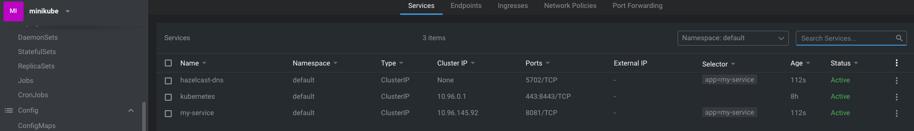

# Build a Spring-boot Hazelcast cluster in Kubernetes
For local testing purposes, you might want to have a cluster of microservices that use Hazelcast where you can watch the replication, rollout of pods and test some Kubernetes infrastructure-related changes.

### Prerequisites
* [Docker](https://docs.docker.com/get-docker/)
* [minikube](https://minikube.sigs.k8s.io/docs/start/)
* [kubectl](https://kubernetes.io/docs/reference/kubectl/cheatsheet/)
* [helm](https://helm.sh/docs/intro/quickstart/)
* [minikube Dashboard](https://minikube.sigs.k8s.io/docs/handbook/dashboard/) or [Lens](https://k8slens.dev)

### Goal
1. Deploy a spring-boot hazelcast cluster locally using helm and connect to it via hazelcast management center 
2. Isolate the POC in a separate environment and play with the same microservices and Hazelcast upgrades

### Limitations
We cannot push to any cloud image registries like Azure Container Registry, say it's forbidden by the security policy. 

### Local Hazelcast cluster setup
Create a spring boot microservice let's call it `my-service`

### Code configuration
Hazelcast uses by default cluster name `dev`. For the POC we will name it `hazelcast-cluster`. We also provide the cluster DNS name `hazelcast-dns.default.svc.cluster.local`. You can externalize it in a property as well. I also changed the default port to `5702` for sake of the demo

```java
@Bean
public Config config() {
    Config config = new Config();
    config.setInstanceName("my-service");
    config.setClusterName("hazelcast-cluster");
    config.getMapConfig("my-cache").setInMemoryFormat(InMemoryFormat.OBJECT);

    JoinConfig join = config.getNetworkConfig()
            .setPort(5702)
            .getJoin();
    join.getMulticastConfig().setEnabled(false);
    join.getKubernetesConfig()
            .setEnabled(true)
            .setProperty(SERVICE_DNS_PROPERTY, "hazelcast-dns.default.svc.cluster.local")
            .setProperty(DNS_TIMEOUT_PROPERTY, "5");
    return config;
}
@Bean(name = "cacheInstance")
public HazelcastInstance hazelcastInstance(Config config) {
    return Hazelcast.getOrCreateHazelcastInstance(config);
}
```

### Build the jar
This part is easy.
```bash
gradle clean bootJar
```
#### Test your jar
```bash
java -Dspring.profiles.active=dev \
 -DJASYPT_KEY=jasyptCode \
 -Dspring.config.additional-location=file:application/src/main/resources/application-dev.properties \
 -jar application/build/libs/my-service-0.0.0-local.jar
```
## Build the image
```bash
FROM openjdk:11-jre-slim

ARG APPLICATION_ROOT=/application
ARG LOG_DIR=${APPLICATION_ROOT}/logs
RUN apt update && apt install -y dnsutils
RUN apt update && apt install -y iputils-ping

RUN mkdir -p ${LOG_DIR} && \
    chown 1000:1000 ${LOG_DIR} && \
    chown 1000:1000 ${APPLICATION_ROOT}

COPY *.jar /application/app.jar
COPY application.properties /application/application.properties

RUN chmod 0755 /application && \
    chmod 0444 /application/app.jar

USER 1000:1000

WORKDIR /application

ENTRYPOINT [ "java", "-jar", "/application/app.jar" ]

EXPOSE 8081
```
Move the files to the `/lib` folder, then run from the project root folder:
```bash
docker build --no-cache --progress=plain \
-t my-service:1.0 \
-f platform/docker/Dockerfile application/build/libs
```
Run the container:

```bash
docker run -p 8080:8081  \
-e JASYPT_KEY='xyzZXy123' \
my-service:1.0 \
--spring.config.additional-location=file:/application/application.properties
```

#### You can also mount a volume to not copy everything inside the container
```bash
docker run -p 8080:8081  \
-e JASYPT_KEY='jasyptCode' \
-v "/$(pwd)/application/src/main/resources/application.properties:/application/application.properties" \
my-service:1.0 \                                                                                                                                                                             ─
--spring.config.additional-location=file:/application/application.properties
```
### Check the image
You should see the built image `my-service:1.0`
```bash
docker images
```
# Start Minikube
I assume you have minikube installed.
```bash
minikube start
minikube addons enable ingress #for ingress
minikube addons enable registry #for registry 
```
### Publish docker image
Usually, Helm will fetch it from a container registry. Be we cannot. If we deploy now the Chart, Helm won't see the docker image
We have 2 options:
1. [The easy way](https://minikube.sigs.k8s.io/docs/handbook/pushing/#7-loading-directly-to-in-cluster-container-runtime). Upload the image manually from the host into minikube 
2. The hard way. Create a registry. Details here: 
* [Registry](https://minikube.sigs.k8s.io/docs/handbook/registry) 
* [Docker Registry](https://docs.docker.com/registry)

#### Load image in minikube
```bash
minikube image load my-service:1.0  
```
Keep in mind you have 2 docker engines, the local and the one inside minikube, this is why we need to pull and load(upload) images to minikube's docker. You can avoid this by pointing the docker CLI to the minikube's docker and just build and pull right inside the minikube.
```bash
eval $(minikube -p minikube docker-env) //point docker to internal minikube docker
eval $(minikube docker-env --unset) //point docker back to your local docker
```

## Helm Chart
Chart.yaml
```yaml
apiVersion: v1
description: A Helm chart for Kubernetes for service my-service
name: my-service
version: 0.1.0
```
Some values.yaml
```yaml
environment: "local"
replicaCount: "2"
image:
  repository: "my-service" // when on local use only the image name
  tag: "1.0"
  pullPolicy: "Never" // do not pull it from any repo, load from minikube internals
service:
  externalPort: "8081"
  internalPort: "8081"
```
The placeholders are automatically resolved by Helm
```yaml
apiVersion: apps/v1
kind: Deployment
metadata:
  name: {{ .Chart.Name }}
  labels:
    app: {{ .Chart.Name }}
spec:
  replicas: {{ .Values.replicaCount }}
  selector:
    matchLabels:
      app: {{ .Chart.Name }}
  template:
    metadata:
      labels:
        app: {{ .Chart.Name }}
    spec:
      securityContext:
        runAsUser: 1000
      containers:
        - name: {{ .Chart.Name }}
          image: "{{ .Values.image.repository }}:{{ .Values.image.tag }}"
          args: [ "--spring.config.additional-location=file:/application/application.properties" ]
          imagePullPolicy: {{ .Values.image.pullPolicy }}
          ports:
            - containerPort: {{ .Values.service.internalPort }}
          env:
            - name: JAVA_TOOL_OPTIONS
              value: -Xms512m -XX:MaxRAMPercentage=75.0 -XX:MaxMetaspaceSize=300m -XX:+PrintFlagsFinal -XshowSettings:vm
            - name: ENVIRONMENT
              value: {{ .Values.environment }}
            - name: JASYPT_KEY
              value: anotherKey
          livenessProbe:
            httpGet:
              path: /actuator/health/liveness
              port: {{ .Values.service.internalPort }}
              scheme: HTTP
            initialDelaySeconds: 120
            periodSeconds: 20
            timeoutSeconds: 6
          readinessProbe:
            httpGet:
              path: /actuator/health/readiness
              port: {{ .Values.service.internalPort }}
              scheme: HTTP
            initialDelaySeconds: 120
            periodSeconds: 30
            timeoutSeconds: 6
```
ingress.yaml. Open access to service under a certain path using rewrite-target, regex group $2
```yaml
apiVersion: networking.k8s.io/v1
kind: Ingress
metadata:
  name: my-ingress
  annotations:
    nginx.ingress.kubernetes.io/rewrite-target: /$2
spec:
  rules:
    - host: my-host
    - http:
        paths:
          - path: /mega(/|$)(.*)
            pathType: Prefix
            backend:
              service:
                name: my-service
                port:
                  number: 8081

```

### Deploy Helm Chart in minikube
Some Helm commands that you might want to use
```bash
helm install hazelcast-poc platform/helm/my-service #execute this one
helm upgrade hazelcast-poc platform/helm/my-service 
helm rollback hazelcast-poc 
helm uninstall hazelcast-poc
```


Shell into one pod and test the DNS. You should see your 2 pods
```bash
I have no name!@my-service-679d747874-vklld:/application$ nslookup hazelcast-dns
Server:         10.96.0.10
Address:        10.96.0.10#53

Name:   hazelcast-dns.default.svc.cluster.local
Address: 172.17.0.7
Name:   hazelcast-dns.default.svc.cluster.local
Address: 172.17.0.6

I have no name!@my-service-679d747874-vklld:/application$  
```
### Deploy hazelcast management center
```bash
minikube image pull hazelcast/management-center
```
Launch the pod
```bash
kubectl create deployment hazelcast-center --image=hazelcast/management-center:latest 
```

### Forward the port
```bash
kubectl get pods
kubectl port-forward hazelcast-center-6f9b687779-krvl7 8080:8080  
```
Open management center in browser `localhost:8080`. If you don't see both members in the cluster, you can downscale the pods, they will appear.


### Ingress
We can also access our service via ingress on path `localhost/mega`.
Before that enable minikube ingress tunneling:
```bash
minikube tunnel
```

```bash
curl http://localhost/mega/actuator/loggers/root
# {"effectiveLevel":"INFO"}
```

Play with the incremental Hazelcast upgrade by building new images and upgrading the Helm chart.
Happy Helming
