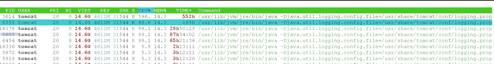

# 🧑‍🎓 tltr

Infinite while loop was causing the issue. Write unit tests. Test the exit condition of your while loops.

# 🐛 Issue
We had some kind of serious performance issue on production. The CPU periodically was pegged at 100% and stayed that way until we restarted the [Tomcat](https://tomcat.apache.org). It was degrading the overall site performance for quite a while. We had two instances with peak similarly in CPU. Seems like it must be something inside the Tomcat since that's what is eating the CPU.

**Here is the 6-week view:**


**Here is the 12-week view:**


The immediate fall of the CPU is where we restart the Tomcat. \
As you see, after the restart, the CPU jumps back on the ladder 🪜 in a couple of days.

# 🕵️‍♂️ Investigation
### 1. Thread dump & top -H
On Linux, the `top -h <pid>` is useful to determine the overall usage by all processes and break it down to certain threads within a process. 
Our [PID](https://en.wikipedia.org/wiki/Process_identifier):


Run `kill 3 <pid>` on the main PID that's consuming a lot of CPU. This will give you the thread dump. It does not stop the running process, but it stops the world inside the JVM.

What we see is **596** of CPU%. This is related to the number of cores attached to the machine. One core is 100% \
Convert the PID from `top -H` from decimal to hex and match it with the `nid` from the thread dump.
```
6458 -> nid=0x1936 
```

Not the ideal way to monitor a JVM instance. You should prefer agents like [Sematext](https://sematext.com/docs/agents/sematext-agent/), [JProfiler](https://www.ej-technologies.com/download/jprofiler/files), [YourKit](https://www.yourkit.com/java/profiler/purchase/) or [JFR](https://access.redhat.com/solutions/662203). But we have what we have 👉

```
"http-nio-8080-exec-127" #328 daemon prio=5 os_prio=0 tid=0x00007f9f20020000 lwp=6454 nid=0x1936 runnable [0x00007f9e4ada4000]
   java.lang.Thread.State: RUNNABLE
    at java.util.HashMap.hash(HashMap.java:339)
    at java.util.HashMap.put(HashMap.java:612)
    at java.util.HashSet.add(HashSet.java:220)
    at java_util_Set$add$0.call(Unknown Source)
    at com.site.api.Controller.method(Controller.groovy:95)
    at com.site.api.Controller.method(Controller.groovy)
"http-nio-8080-exec-156" #39893 daemon prio=5 os_prio=0 tid=0x00007f9f20024000 lwp=18378 nid=0x47ca runnable [0x00007f9e3199e000]
   java.lang.Thread.State: RUNNABLE
    at java.util.HashMap.hash(HashMap.java:339)
    at java.util.HashMap.put(HashMap.java:612)
    at java.util.HashSet.add(HashSet.java:220)
    at java_util_Set$add$0.call(Unknown Source)
    at com.site.api.Controller.method(Controller.groovy:95)
    at com.site.api.Controller.method(Controller.groovy)
"http-nio-8080-exec-95" #203 daemon prio=5 os_prio=0 tid=0x00007f9f200a9000 lwp=5605 nid=0x15e5 runnable [0x00007f9e48d82000]
   java.lang.Thread.State: RUNNABLE
    at com.site.api.Controller.method(Controller.groovy:95)
    at com.site.api.Controller.method(Controller.groovy)
    at com.site.api.Controller$$FastClassBySpringCGLIB$$8fdc140f.invoke(<generated>)
    at org.springframework.cglib.proxy.MethodProxy.invoke(MethodProxy.java:218)
    at org.springframework.aop.framework.CglibAopProxy$CglibMethodInvocation.invokeJoinpoint(CglibAopProxy.java:752)
    at org.springframework.aop.framework.ReflectiveMethodInvocation.proceed(ReflectiveMethodInvocation.java:163)
"http-nio-8080-exec-120" #321 daemon prio=5 os_prio=0 tid=0x00007f9f20036800 lwp=6351 nid=0x18cf runnable [0x00007f9e4cec3000]
   java.lang.Thread.State: RUNNABLE
    at java_util_Set$add$0.call(Unknown Source)
    at com.site.api.Controller.method(Controller.groovy:95)
    at com.site.api.Controller.method(Controller.groovy)
    at com.site.api.Controller$$FastClassBySpringCGLIB$$8fdc140f.invoke(<generated>)
    at org.springframework.cglib.proxy.MethodProxy.invoke(MethodProxy.java:218)
    at org.springframework.aop.framework.CglibAopProxy$CglibMethodInvocation.invokeJoinpoint(CglibAopProxy.java:752)
```


### 2. Traffic
I analyzed the traffic at the point of time where the CPU jumps. I got some **httpd** logs. \
**httpd** is in front of Tomcat for [PerimeterX](https://www.perimeterx.com) compatibility. \
Example of logs:
```logs
87.250.224.200 - - [06/Jun/2022:21:17:08 +0000] "GET /the-faulty-endpoint/id-1 HTTP/1.1" 502 341 "https://www.site.com/pages/page-1" "Mozilla/5.0 (compatible; YandexBot/3.0; +http://yandex.com/bots) AppleWebKit/537.36 (KHTML, like Gecko) Chrome/81.0.4044.268" 120120565
85.45.207.139 - - [06/Jun/2022:21:18:08 +0000] "GET /the-faulty-endpoint/id-2 HTTP/1.1" 502 341 "https://www.site.com/pages/page-1" "Mozilla/5.0 (compatible; YandexBot/3.0; +http://yandex.com/bots) AppleWebKit/537.36 (KHTML, like Gecko) Chrome/81.0.4044.268" 120122901
```
At that point in point in time, I saw just a lot of bots (Apple, Google, Yandex, Bing) indexing the pages

## ✅ Put things together

What we have now is the requests which tell us the URLs that are called and the values in a URLs. \
The values in the paths are different `id-1`, `id-2`, `id-n`. \
We also have the code, which we can analyze locally. Code has no tests 😒

Simplified pseudo-code:
```java
int rowsInDB = findBy('id-from-url');
int buffer = 10;
int minRows = Math.min(rowsInDB, rowsInDB + 10);
Set randomIndexes = [];

while (randomIndexes.size() < buffer) {
   randomIndexes.add(random.nextInt(minRows));
}
```
At first, I could not spot the bug because I was on the local environment with no data in my H2 database.

I assembled a list of all the requests within CPU increase timeframe into a CSV file. \
Launched locally the JMeter, VisualVM, JDK Mission Control and the app connected to the QA database with data and fired all the requests to my local instance. Finally, I noticed locally a CPU increase, which is not going down. 

There was an `id` that returned `5` rows from the database. Then I realized that the problem is related to the `random.nextInt(minRows)` and the Set collection. Here is why:

```java
int rowsInDB = findBy('faulty-id'); //returns 5
int buffer = 10;
int minRows = Math.min(rowsInDB, rowsInDB + 10); //here we get 5
Set randomIndexes = [];

while (randomIndexes.size() < buffer) {
   randomIndexes.add(random.nextInt(minRows)); //seed is 5
}
```

The Set will not increase its size because it accepts unique values that are always between `0-4`. Set can contain only `0,1,2,3,4`. The size of the set will not increase more than `5` where the buffer is always `10` - infinite loop detected.


Wrote a unit test, confirmed the bug, fixed the test, made a hotfix.

# 📚 Userfull links
[How to get thread id and stack](https://stackoverflow.com/questions/222108/getting-the-java-thread-id-and-stack-trace-of-run-away-java-thread) \
[IBM best practices](https://www.ibm.com/docs/en/baw/19.x?topic=issues-best-practices-high-jvm-cpu-utilization) \
[Top -H](https://backstage.forgerock.com/knowledge/kb/article/a48313100) \
[Fastthread.io](https://fastthread.io/)