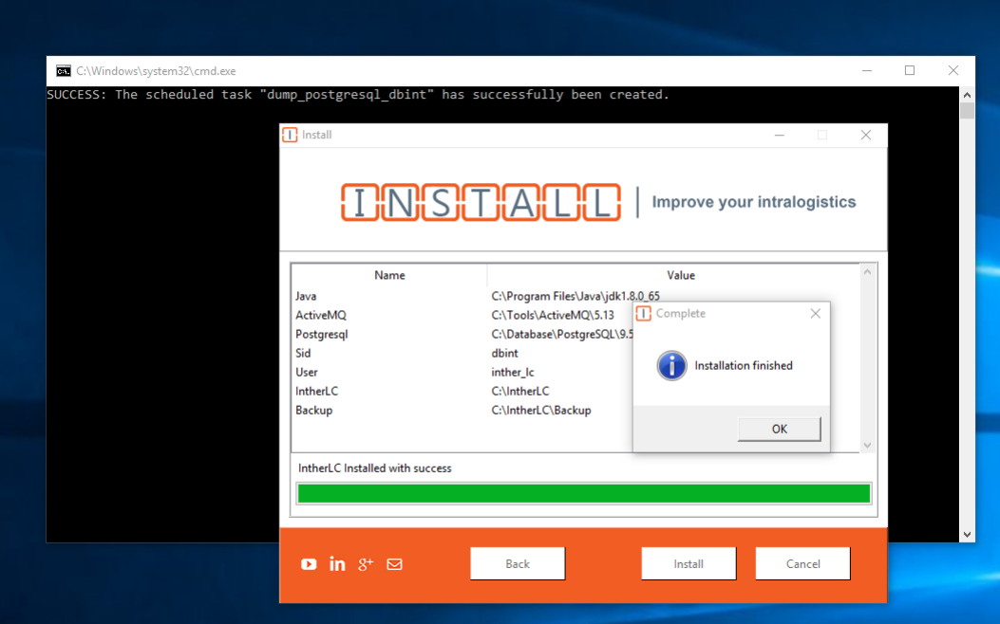

&nbsp;&nbsp;&nbsp;&nbsp;&nbsp;&nbsp;All companies have a delivery pipeline of the product. Every company can create its own pipeline and choose any strategy to deliver. In this post I’m going to talk about NSIS and Python. I had a task to think about the product deployment in the company I’m working for. Before I got this task, we used to copy paste files via RDP and VPN to the client server and install them manually. Copying the files was implying many risks like:

🚫 A file is missing!\
🚫 Where is Next, Next, Next, Accept, Install?\
🚫 Developer does not know the procedure of installing the product!\
🚫 What should developer do with the database dump?\
🚫 What environment variables are needed for the product to run?

For the client, we can had different solutions that might look like a pipeline:

* We could build a full continuous delivery to the client server (from Jenkins to Production)
* We could host client’s product on our hardware or we could deploy it somewhere in a cloud service, like Azure, AWS...
* We could create an .exe file and install it on the client server;
* Continue copy-pasting the files.

In order to ensure a full continuous delivery we need either to host the client’s product ourselves or to run the client products in cloud, but this had its own disadvantages for this particular client:

* Client had his intranet and different security policies around it
* He considered expensive hardware or expensive traffic
* Client had only Windows virtual machines

&nbsp;&nbsp;&nbsp;&nbsp;&nbsp;&nbsp;Internally, at that time, we had a project, which I investigated to see how it was built, written in NSIS that was preparing the DEV environment. Therefore, I decided to have a look at NSIS and build an EXE that would install our product on the client server. Having an .exe does not require many costs and it is relatively simple to do next, next, next and install for everyone from service department.

NSIS is a script-driven Installer authoring tool for Microsoft Windows with minimal overhead backed by Nullsoft, the creators of Winamp. NSIS is released under a combination of free software licenses, primarily the zlib license.
Well, after a couple of weeks, I’ve written the installer and it looks like this:


&nbsp;&nbsp;&nbsp;&nbsp;&nbsp;&nbsp;Each customer project has a configuration file, in which the developer fills what third party components the project needs. Everything was fine, we used the NSIS installer to set up a couple of projects, but then we realized that nobody except me knew how this works and how NSIS looks like. I was always asked to have a look at why something was not installed or crashed during the installation (not the perfect code). Why? Because of NSIS. For other developers this was a quite unknown scripting language. In addition, I can say that this is also a complex language with a complex syntax. We were all Java developers that’s why everyone avoided it.

## Why was NSIS a pain in the 🍑?
### Pop, Push, Exch… The Stack and shared $0-$9 $R0-$R9 registers

There is a stack where you have to push and pop values and a couple of registers where you can save some specific values. I was using the registers for time and date because I’ve created a custom logger in NSIS, which was writing logs into a file at runtime. I did not like NSIS because it does not have variables that we are used to in Java.

### Complex looping in stack
When it came up to use some loops, I realized that this is very different from a simple PASCAL loop. Even in PASCAL, it is easier to write a loop. Here is an example:

```bash
function FileScanner.searchFNC
        pop $FileScanner.callBackAddress
        pop $FileScanner.getMask
        pop $FileScanner.directoryToSearch
 
 ${locate::Open} &quot;$FileScanner.directoryToSearch&quot; `$FileScanner.getMask` $FileScanner.getHandle
 StrCmp $FileScanner.getHandle 0 0 loop
 MessageBox MB_OK &quot;Error&quot; IDOK close
 loop:
 ${locate::Find} $FileScanner.getHandle $FileScanner.getPathName $FileScanner.getPath $FileScanner.getName $FileScanner.getSize $FileScanner.getTime $FileScanner.getAttr
 
 /*MessageBox MB_OKCANCEL '$$R1    &quot;pathname&quot;   =[$R1]$n
                           $$R2    &quot;path&quot;        =[$R2]$n
                           $$R3    &quot;name&quot;        =[$R3]$n
                           $$R4    &quot;size&quot;        =[$R4]$n
                           $$R5    &quot;time&quot;        =[$R5]$n
                           $$R6    &quot;attributes&quot;  =[$R6]$n
         $n'*/
 ${Logger.log} &quot;Found : $FileScanner.getPathName&quot;
        ${If} $FileScanner.getName == &quot;&quot;
              goto close
        ${Else}
               call $FileScanner.callBackAddress
        ${EndIf}
        goto loop
 close:
 ${locate::Close} $FileScanner.getHandle
 ${locate::Unload}
functionend
```
### No debug

I hadn’t managed to find a good way of debugging a NSIS script at runtime. I had found a plugin called **Dumpstate** which was stopping the installer at the **breakpoint** and showing me the state of the registries and the stack. However, it was very difficult to understand why it was failing at certain points.


### No OOP
In NSIS I could not use the OOP principles. I was not able to create objects. I had to simulate it with macros and separate files that had getters.
```bash
function ActiveMQ.setup
 ${Logger.log} &quot;Installing ActiveMQ&quot;
 DetailPrint &quot;Installing ActiveMQ&quot;
 ${Logger.log} &quot;Copy ActiveMQ file to directory $DirectoryPage.getUserActiveMQDirectory&quot;
 CopyFiles /SILENT '$EXEDIR${ComponentLocation.activemq}*.*' '$DirectoryPage.getUserActiveMQDirectory'
 nsExec::ExecToLog &quot;$DirectoryPage.getUserActiveMQDirectorybinwin$System.getSystemBitTypeInstallService.bat&quot;
 pop $1
 ${System.checkScriptStatus} &quot;$DirectoryPage.getUserActiveMQDirectorybinwin$System.getSystemBitTypeInstallService.bat&quot; $1
 pop $0
 ${Logger.log} &quot;ActiveMQ was installed successfuly&quot;
 DetailPrint &quot;ActiveMQ was installed successfuly&quot;
 functionEnd
```

### Plugins never work
During the development, I was always searching for plugins that would save time and shorten the code. Sadly it wasn’t always the case. Every time I tried a new plugin it was failing. Besides this, the documentation for some of them was missing. Each project has its own .nsis files inside the Java module that has to be compiled via a Maven goal to get the .exe file. So, the pipeline was bounded to the NSIS compiler when we were preparing the install package. This was time consuming and the DEV machine had to have a compiler installed.

## Python
NSIS was a mistake, and I admit it. Half a year later, I decided that because I was the one who has created the installer with NSIS and it was so hard to maintain, I should be the one who will change it! It is time to use another language and another approach. First, I thought to remove the pre-processing steps like compiling .nsis files to have the install pack faster. I’ve decided to make the installer as a separate project.

I’ve decided to build it in Python, I want to learn it. Python had everything I needed:

* GUI libs
* OOP
* Easy syntax
* Widely supported
* Extensible.


The main idea remained the same. The client project has the same file with the dependencies it requires. The only difference is that for now Python has to be installed on the production server to run the installer. How to do that? Simple… self-extracting archive solution provided by 7ZIP. You can configure a .bat file to run after the extraction has been finished. The procedure of creating the install pack also remained the same. Nobody even noticed anything.

Here is how the new installer looks like:


## Conclusion
Think twice when it comes to choose a development language. I really enjoyed working in Python and building the installer from scratch rather than in NSIS. Having the installer as a modern separate project makes it easy to maintain and improve not only by me, but by other developers as well, who know python.