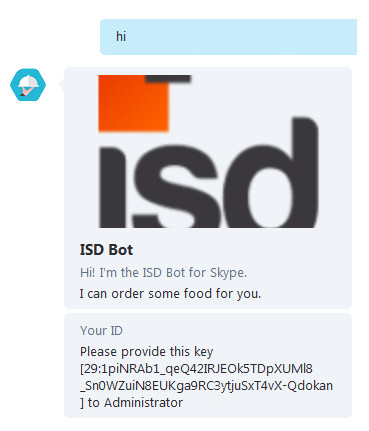
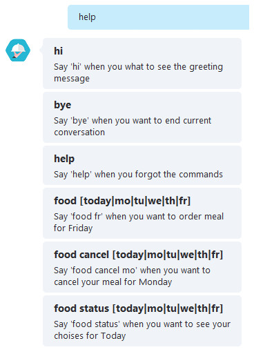

# Intro

Once I read a [post](https://www.dataquest.io/blog/apartment-finding-slackbot/) about a guy who was searching for an apartment in San Francisco. He was annoyed about the fact that searching for “How to find an apartment in San Francisco” on Google yields dozens of pages of advice as a good indicator of apartment hunting and this is a painful process.

So he decided to implement a bot in Slack that would help him to search an apartment based on scraping data from websites and notifying him about the cheapest and closest apartment around him. His idea inspired me to create a bot, although I didn’t know at that time what are the functionalities I am going to build.

# The idea
We started brainstorming, suddenly in the Skype chat I saw “Don’t forget to order food”. Let me explain, internally we ordered food from a local catering company and our office manager each morning was pasting this message. We have a google sheet where we store our choices. Later, based on choices, the office manager places an order. That is it! We need a bot that would order food for us. A lad [charea](https://github.com/charea) joined me so we could do it twice as fast (we thought).

# Choosing the right tools
Together we started to investigate on what platforms a bot can be built and we found a quite new and fresh platform, that is developed by Microsoft, called Microsoft Bot framework. We have found it very interesting and powerful. The only thing we had to do is to register on their platform. They provide an API in NodeJS and C#. We haven’t spent a lot of time choosing. Since we do Java and C# is almost the same, we decided to go for NodeJS because it was something new for us. If we had chosen C#, then the development of the bot would not have been so funny and challenging.

## Microsoft Bot framework
* It enables organizations to build intelligent agents, known as Bots.
* The Framework provides developers with a developer portal and SDK to build Bots, a Bot Connector service to connect to social channels such as Twitter and Slack, and a Bot Directory (Marketplace) to discover and use existing bots
* It supports Node JS and C#.
* It provides a powerful session management and some interactive cards like Hero, Thumbnail, Receipt and Sign-In.

## NodeJS & ES6
We will not speak a lot about NodeJS, but there is something to mention:

* An important thing to realize is that Node is not a web server. By itself it doesn’t do anything. It doesn’t work like Apache. There is no config file where you point it to your HTML files. If you want it to be a HTTP server, you have to write an HTTP server (with the help of its built-in libraries).\
* Node.js is just another way to execute code on your computer. It is simply a JavaScript run time;
* ECMAScript 6 is a new version of ECMAScript providing a new set of features and fixes to JavaScript.
## IDE
This was another tool we had to decide on. There aren’t a lot of free good IDEs that would support NodeJS. Most popular found:

* Webstorm (30 days)
* Netbeans 8.2 (free)
* Eclipse (using some plugins)
* Sublime
* Atom
We went for Webstorm and Netbeans. Btw Webstorm is the best.

## Bot Framework simulator
Another tool we have had is the simulator provided by the platform. This tool is simulating a REST server with which our bot communicates using the predefined API. It is like a local Skype server. This gives you the possibility to chat with your bot locally without deploying it. Using the Emulator, you can:
* Send requests and receive responses to/from your bot endpoint on localhost;
* Inspect the JSON response;
* Emulate a specific user and/or conversation.

## Google API
In order to be able to access Google Spreadsheets we needed to find a way of interacting with our application, and luckily for us, Google officially supported a Node.js client library for accessing Google APIs. Support for authorization and authentication with OAuth 2.0, API Keys and JWT is included. At this point we had to choose which type of authentication fits best for us. Since we needed a type of authentication in which the end-user would not be involved in the process of generating tokens to establish the identity within Google API, we had chosen JWT(JSON Web Token).

Tokens are generated for a service account, which is created from the Google API console. Service accounts must also be granted access to resources, using traditional assignation of permissions using the unique service account email address. The application requests a token that can be used for authentication in exchange with a valid JWT. The resulting token can then be used for multiple API calls, until it expires and a new token must be obtained by submitting another JWT.

# The Bot
Mainly our bot gathers user choices regarding lunch options and places orders in the Google Sheet. To use the bot it is necessary to install it via a Skype, join URL and register yourself. The registration itself is implemented in a very simple way. We have two locked columns in the Google Sheet. First column is the ID and the second one is the Skype name. For each Skype name we have a specific ID. This ID is provided by the Skype service. After the user completes the registration, he/she is able to use the bot. The bot provides some dialogs that help the user choosing his/her meal:

## Interactive Dialogs:

* Greeting Dialog
* Help
* Place Order
* Cancel Orders
* Status
## Non interactive Dialogs:

* Jokes
Let’s have a closer look at them.

## Greeting Dialog
This dialog provides a greeting message together with the user ID that needs to be sent to the administrator. The trigger keyword is ‘hi’.

## Help **Dialog**
Dialog that shows to the user all commands that can be entered. The trigger keyword is ‘help’.

## Place Order Dialogs
* If the user is hungry then he/she has to place the order by writing ‘food’
* The Bot will show the menu for the current day. If the user wants to order food for another day then the command should be like : ‘food (today|mo|tu|we|th|fr)’
* It is possible to order more than 1 meal per day. Number of orders per one day is equal with the number of rows related to the user in the Google Sheet
* If the user has 1 meal and it’s completed it will be overridden
* If the user has 2 or more meals and these are completed, the bot will ask him to cancel one of them
* This Dialog is triggered by a cron expression that is running in background

## Cancel Order Dialog
* In case the user decided to cancel an order, he/she has to write: ‘food cancel (today|mo|tu|we|th|fr)’ by specifying the day for which the he/she wants to cancel the order
* If the user has more than 1 meals on that day, the bot will ask him to cancel 1 meal

## Status Dialog
* In order to see what is the current choice, the user can write ‘food status’
* The Bot will show the user’s today choices
* If the user wants to see the food status for another day then the ‘food status (today|mo|tu|we|th|fr)’ command can be used.

# Heroku integration and hot deploy
You may ask yourself where do we run it. We have chosen the PaaS platform HEROKU that is very easy to use:

Heroku is a cloud platform that lets companies build, deliver, monitor and scale apps — we’re the fastest way to go from idea to URL, bypassing all those infrastructure headaches;
Heroku is a cloud platform as a service(PaaS). That means you do not have to worry about infrastructure, you just focus on your application.

## Here are some features of Heroku
* Instant Deployment with Git push – the build of your application is performed by Heroku using your build scripts
* Plenty of Add-on resources (applications, databases etc.)
* Processes scaling – independent scaling for each component of your app without affecting functionality and performance
* Isolation – each process (aka dyno) is completely isolated from each other;
* Full Logging and Visibility – easy access to all logging output from every component of your app and each process (dyno);
* Heroku provides very well written tutorial which allows you to start in minutes. Also they provide first 750 computation hours free of charge which means you can have one processes (aka Dyno) at no cost. Also performance is very good e.g.a simple web application written in Node.js can handle around 60 – 70 requests per second.

# Publishing the bot
Publishing the bot basically means to add it to the Bot Directory which is a public directory of all bots that were registered and published within the Microsoft Bot Framework. Users can select your bot in the directory and add it to one or more of the configured channels that they use. After you publish your bot, Microsoft will review your bot submission to make sure it meets a certain minimum requirements before it is publicly available on the Bot Directory. Although, the bot can be used without being published, there is a limit of 100 users.

