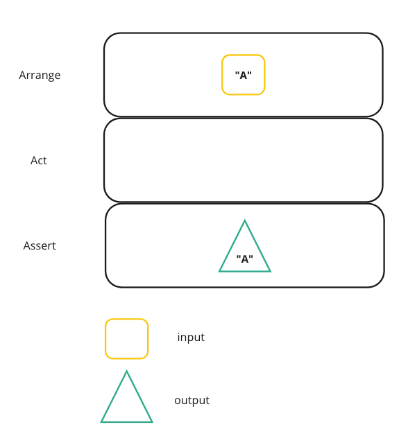
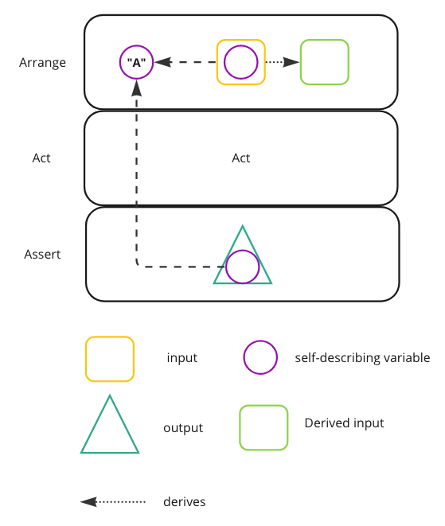
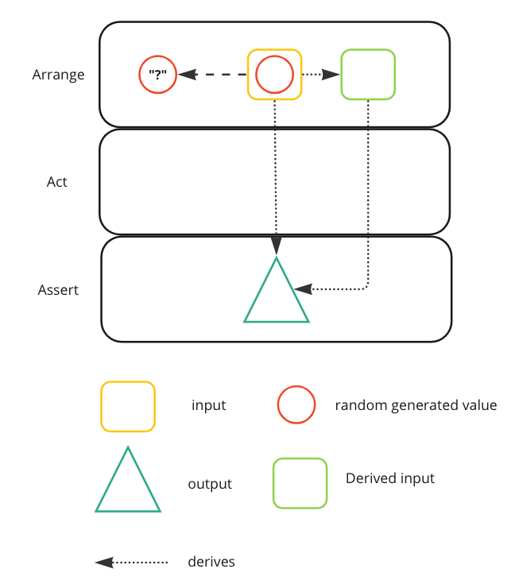
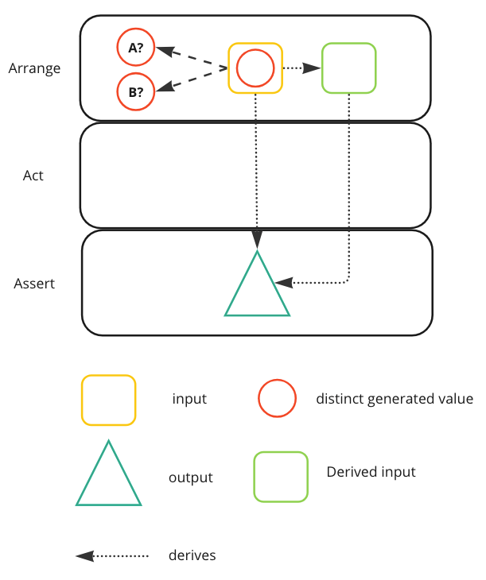
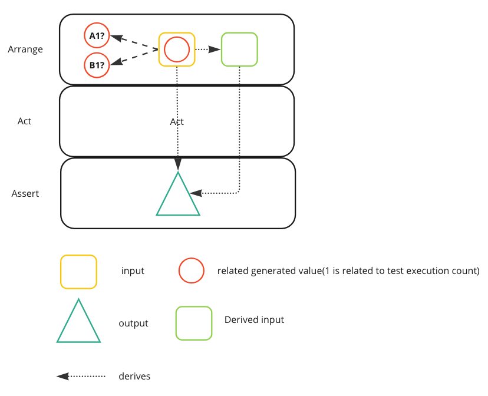

## How do we specify the values to be used in tests?
The values assigned to the attributes of objects in our test fixture and the expected outcome of our test are frequently interconnected, as defined in the requirements. It is vital to accurately determine these values and understand the relationship between the pre-conditions and post-conditions. This relationship plays a critical role in ensuring the correct behavior is incorporated into the System Under Test (SUT).

## Literal
### We use literal constants for object attributes and assertions

_Literal Values_ are a popular way to specify the values of attributes of objects in a test. Using a _Literal Value_ in-line makes it very clear which value is being used. There is no doubt about the value’s identity because it is right in front of our face. Unfortunately, using Literal Values can make it difficult to see the relationships between the values used in various places in the test, which may in turn lead to _Obscure Tests_. When the same value needs to be used in several places in the test
(typically during fixture setup and result verification), this approach can obscure the relationship between the test pre-conditions and post-conditions
It certainly makes sense to use _Literal Values_ if the testing requirements specify which values are to be used and we want to make it clear that we are, in fact, using those values.

One downside of using a _Literal Value_ is that we might use the same value for two unrelated attributes; if the SUT happens to use the wrong one, tests may pass even though they should not. If the _Literal Value_ is a filename or a key used to access a database, the meaning of the value is lost—the content of the file or record actually drives the behavior of the SUT. Using a _Literal Value_ as the key does nothing to help the reader understand the test in such a case, and we are likely to suffer from _Obscure Tests_.

If the values in the expected outcome can be derived from the values in the fixture setup logic, we will be more likely to use the _Tests as Documentation_ if we use _Derived Values_. Conversely, if the values are not important to the specification of the logic being tested, we should consider using _Generated Values_

```java
class Test{
    public void aTest (){
        Player player = new Player("Name", "Surname");
        player.jersey = new Jersey("Initials", 10);
        
        when(repo.findBy(player.jersay.number)).thenReturn(player); 
        
        PlayerDto actualPlayer = sut.getPlayer();
        
        assertThat(actualPlayer.name).isEqual("Name");
        assertThat(actualPlayer.surname).isEqual("Surname");
        assertThat(actualPlayer.jersey.number).isEqual(10);
        assertThat(actualPlayer.jersey.initials).isEqual("Initials");
        assertThat(actualPlayer.fullName).isEqual("Name Surname");
    }
}
```


Cause: Irrelevant Information
The test exposes a lot of irrelevant details about the fixture that distract the test reader from what really affects the behavior of the SUT.

As test readers, we find it hard to determine which of the values passed to objects actually affect the expected outcome. A test contains a lot of data, either as Literal Values or as variables.
Irrelevant Information often occurs in conjunction with _Hard-Coded Test Data_ or a _General Fixture_ but can also arise because we make visible all data the
test needs to execute rather than focusing on the data the test needs to be understood

Cause: Hard-Coded Test Data
Data values in the fixture, assertions, or arguments of the SUT are hard-coded in the Test Method, obscuring cause–effect relationships between inputs and expected outputs. As test readers, we find it difficult to determine how various hard-coded (i.e., literal) values in the test are related to one another and which values should affect the behavior of the SUT. We may also encounter behavior smells such as Erratic Tests.

_Hard-Coded Test Data_ occurs when a test contains a lot of seemingly unrelated Literal Values. Tests When we use “cut-and-paste” reuse of test logic, we find ourselves replicating the literal values to the derivative tests.

### Symbolic Constant

To reduce duplication we can Symbolic Constant (local constant):

```java
class Test {
    public void aTest() {
        String name = "Name";
        String surname = "Surname";
        Player player = new Player(name, surname);
        String initials = "Initials";
        int jerseyNumber = 10;
        player.jersey = new Jersey(initials, jerseyNumber);

        when(repo.findBy(player.jersay.number)).thenReturn(player); 

        PlayerDto actualPlayer = sut.getPlayer();

        assertThat(actualPlayer.name).isEqual(name);
        assertThat(actualPlayer.surname).isEqual(surname);
        assertThat(actualPlayer.jersey.number).isEqual(jerseyNumber);
        assertThat(actualPlayer.jersey.initials).isEqual(initials);
        String nameSurname = "Name Surname";
        assertThat(actualPlayer.fullName).isEqual(nameSurname);
    }
}
```
### Self-Describing Value

To make it more readable useful to choose a value that describes the role of the value in the test:

```java
class Test{
    public void aTest (){
        String name = "Andres";
        String surname = "Iniesta";
        Player player = new Player(name, surname);
        String initials = "AS";
        int jerseyNumber = 10;
        player.jersey = new Jersey(initials, jerseyNumber);

        when(repo.findBy(player.jersay.number)).thenReturn(player); 

        PlayerDto actualPlayer = sut.getPlayer();

        assertThat(actualPlayer.name).isEqual(name);
        assertThat(actualPlayer.surname).isEqual(surname);
        assertThat(actualPlayer.jersey.number).isEqual(10);
        assertThat(actualPlayer.jersey.initials).isEqual(initials);
        String nameSurname = "Andres Iniesta";
        assertThat(actualPlayer.fullName).isEqual(nameSurname);
    }
}
```


## Derived Value
### We use expressions to calculate values that can be derived from other values

Often, some of these values can be derived from other values in the same test. In these cases the benefits from using our _Tests as Documentation_ are improved if we show the derivation by calculating the values using the appropriate expression.

Computers excel at math and string concatenation, allowing us to code expected results directly into tests using Assertion Method calls. _Derived Values_ are useful for creating fixture objects and exercising the SUT, encouraging the use of variables or constants to hold values. These variables/constants can be initialized at compile time, during initialization, fixture setup, or within the Test Method itself.

We should use a _Derived Value_ whenever we have values that can be derived in some deterministic way from other values in our tests. The main drawback of using Derived Values is that the same math error (e.g., rounding errors) could appear in both the SUT and the tests. To be safe, we might want to code a few of the pathological test cases using _Literal Values_ just in case such a problem might be present. If the values we are using must be unique or don’t affect the logic in the SUT, we may be better off using _Generated Values_ instead. We can use a _Derived Value_ either as part of fixture setup (Derived Input or One Bad Attribute) or when determining the expected values to be compared with those generated by the SUT (Derived Expectation).

When the SUT's output should be related to the input values, we can dynamically derive the expected value during the test execution. This eliminates the need for precalculated Literal Values and allows us to use an Equality Assertion to verify the result.


### Derived Input

Sometimes our test fixture contains similar values that the SUT might compare or use to base its logic on the difference between them. This operation makes the relationship between the two values explicit. See `initials`

```java
class Test{
    public void aTest (){
        String name = "Andres";
        String surname = "Iniesta";
        Player player = new Player(name, surname);
        String initials = String.valueOf(name.charAt(0)) + surname.charAt(0);
        int jerseyNumber = 10;
        player.jersey = new Jersey(initials, jerseyNumber);

        when(repo.findBy(player.jersay.number)).thenReturn(player); 

        PlayerDto actualPlayer = sut.getPlayer();

        assertThat(actualPlayer.name).isEqual(name);
        assertThat(actualPlayer.surname).isEqual(surname);
        assertThat(actualPlayer.jersey.number).isEqual(10);
        assertThat(actualPlayer.jersey.initials).isEqual(initials);
        String nameSurname = "Andres Iniesta";
        assertThat(actualPlayer.fullName).isEqual(nameSurname);
    }
}
```

### Derived Expectation

When some value produced by the SUT should be related to one or more of the values we passed in to the SUT as arguments or as values in the fixture, we can often derive the expected value from the input values as the test executes rather than using precalculated Literal Values. We then use the result as the expected value in an Equality Assertion. To make this test more readable, we can replace any Literal Values that are actually derived from other values with formulas that calculate these values. See assertions derived from input `player`. This way the local variable are on the top, use only at the creation of the fixture where the expected values are derived 

```java
class Test{
    public void aTest (){
        String name = "Andres";
        String surname = "Iniesta";
        Player player = new Player(name, surname);
        String initials = String.valueOf(name.charAt(0)) + surname.charAt(0);
        int jerseyNumber = 10;
        player.jersey = new Jersey(initials, jerseyNumber);

        when(repo.findBy(player.jersay.number)).thenReturn(player); 

        PlayerDto actualPlayer = sut.getPlayer();

        assertThat(actualPlayer.name).isEqual(player.name);
        assertThat(actualPlayer.surname).isEqual(player.surname);
        assertThat(actualPlayer.jersey.number).isEqual(player.jersey.number);
        assertThat(actualPlayer.jersey.initials).isEqual(player.jersay.initials);
        assertThat(actualPlayer.fullName).isEqual(String.format("%s %s", name, surname));
    }
}
```

## Generated Value
### We generate a suitable value each time the test is run.
When initializing the objects in the test fixture, one issue that must be dealt with is the fact that most objects have various attributes (fields) that need to be supplied as arguments to the constructor. Sometimes the exact values to be used affect the outcome of the test. More often than not, however, it is important only that each object use a different value. When the precise values of these attributes are not important to the test, it is important not to have them visible within the test!
Generated Values are used in conjunction with Creation Methods to help us remove this potentially distracting information from the test.

Instead of deciding which values to use in our tests while we are coding the tests, we generate the values when we actually execute the tests. We can then pick values
to satisfy specific criteria such as “must be unique in the database” that can be determined only as the test run unfolds.

We use a Generated Value whenever we cannot or do not want to specify the test values until the test is executing. Perhaps the value of an attribute is not expected to affect the outcome of the test and we don’t want to be bothered to define _Literal Value_

In some cases, the SUT requires the value of an attribute to be unique; using a _Generated Value_ can ensure that this criterion is satisfied and thereby prevent _Unrepeatable Tests_  and _Test Run Wars_ by reducing the likelihood of a test conflicting with its parallel incarnation in another test run. Optionally, we can use this distinct value for all attributes of the object; object recognition then becomes very easy when we inspect the object in a debugger. One thing to be wary of is that different values could expose different bugs.

One thing to be wary of is that different values could expose different bugs. For example, a single-digit number may be formatted correctly, whereas a multidigit number might not (or vice versa). Generated Values can result in _Nondeterministic Tests_; if we encounter nondeterminism (sometimes the test passes and then fails during the very next run), we must check the SUT code to see whether differences in value could be the root cause.

In general, we shouldn’t use a _Generated Value_ unless the value must be unique because of the nondeterminism such a value may introduce. The obvious alternative is to use a Literal Value. A less obvious alternative is to use a Derived Value, especially when we must determine the expected results of a test.

### Random Generated Values

One way to obtain good test coverage without spending a lot of time analyzing the behavior and generating test conditions is to use different values each time we run the tests. Using a _Random Generated Value_ is one way to accomplish this goal. While use of such values may seem like a good idea, it makes the tests nondeterministic (Nondeterministic Tests) and can make debugging failed tests very difficult. Ideally, when a test fails, we want to be able to repeat that test failure on demand. To do so, we can log the _Random Generated Value_ as the test is run and show it as part of the test failure. We then need to find a way to force the test to use that value again while we are troubleshooting the failed test. In most cases, the effort required outweighs the potential benefit. Of course, when we need this technique, we really need it.

```java
class Test{
    
    public void aTest (){
        String name = StringUtil.randomString();
        String surname = StringUtil.randomString();
        int jerseyNumber = IntegerUtil.randomNumber();
        Player player = new Player(name, surname);
        String initials = String.valueOf(name.charAt(0)) + surname.charAt(0);
        player.jersey = new Jersey(initials, jerseyNumber);

        when(repo.findBy(player.jersay.number)).thenReturn(player);

        PlayerDto actualPlayer = sut.getPlayer();

        assertThat(actualPlayer.name).isEqual(player.name);
        assertThat(actualPlayer.surname).isEqual(player.surname);
        assertThat(actualPlayer.jersey.number).isEqual(player.jersey.number);
        assertThat(actualPlayer.jersey.initials).isEqual(player.jersay.initials);
        assertThat(actualPlayer.fullName).isEqual(String.format("%s %s", name, surname));
    }
}
```

### Distinct Generated Values 

When we need to ensure that each test or object uses a different value, we can take advantage of _Distinct Generated Values_. The values generated in each test are the same for each run and can simplify debugging. This adds value and meaning to random generated values. It's easier to debug. See `Faker`

```java
class Test{
    static int counter = 0;
    public void aTest (){
        String name = Faker.anyName(counter); //Would return for example: Robert1 or Lionel2 
        String surname = Faker.anySurname();
        int jerseyNumber = Faker.anyNumberBetween(1,99);
        Player player = new Player(name, surname);
        String initials = String.valueOf(name.charAt(0)) + surname.charAt(0);
        player.jersey = new Jersey(initials, jerseyNumber);

        when(repo.findBy(player.jersay.number)).thenReturn(player); 

        PlayerDto actualPlayer = sut.getPlayer();

        assertThat(actualPlayer.name).isEqual(player.name);
        assertThat(actualPlayer.surname).isEqual(player.surname);
        assertThat(actualPlayer.jersey.number).isEqual(player.jersey.number);
        assertThat(actualPlayer.jersey.initials).isEqual(player.jersay.initials);
        assertThat(actualPlayer.fullName).isEqual(String.format("%s %s", name, surname));
    }
}
```
### Related Generated Value

With a _Related Generated Value_, all fields of the object contain “related” data, which makes the object easier to recognize when debugging. Another option is to separate the generation of the root from the generation of the values. Another nice touch for strings is to pass a role-describing argument to the function that is combined with the unique integer key to make the code more intent-revealing. Although we could also pass such arguments to the other functions, of course we wouldn’t be able to build them into an integer value.

```java
class Test{
    static int counter = 0;
    public void aTest (){
        String name = Faker.uniqueString("Andres"); //Would return for example: Andres1 or Andres2 
        String surname = Faker.uniqueString("Iniesta"); //Generated values are related to a base input
        int jerseyNumber = Faker.anyNumberBetween(1,99);
        Player player = new Player(name, surname);
        String initials = String.valueOf(name.charAt(0)) + surname.charAt(0);
        player.jersey = new Jersey(initials, jerseyNumber);

        when(repo.findBy(player.jersay.number)).thenReturn(player); 

        PlayerDto actualPlayer = sut.getPlayer();

        assertThat(actualPlayer.name).isEqual(player.name);
        assertThat(actualPlayer.surname).isEqual(player.surname);
        assertThat(actualPlayer.jersey.number).isEqual(player.jersey.number);
        assertThat(actualPlayer.jersey.initials).isEqual(player.jersay.initials);
        assertThat(actualPlayer.fullName).isEqual(String.format("%s %s", name, surname));
    }
}
```
